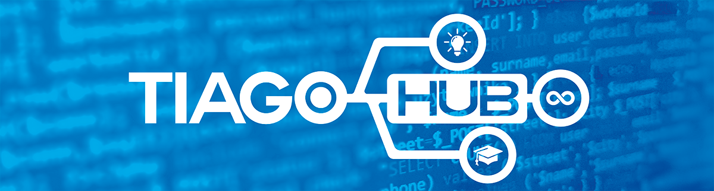

# 👋 Olá, meu nome é Tiago Bezerra dos Santos!

👨‍🏫 **Professor e criador de cursos de Tecnologia**  
🎮 **Desenvolvimento de Jogos 2D | 💻 Desenvolvimento Web Front-End e Back-End | 🚀 Ferramentas para Produtividade**  

Gosto de transformar conhecimento em prática, criando cursos de tecnologia diretos e acessíveis sobre ferramentas essenciais para o desenvolvimento e produtividade.

## 📚 Meus cursos  
🎓 Confira meus cursos lançados na **Udemy** até o momento (18/05/2025):

- [Modelagem e SQL: Da Teoria à Prática em Banco de Dados](https://www.udemy.com/course/modelagem-e-sql/?referralCode=B66F6C184821BA8A7FB2)
- [Git e GitHub Desktop do Zero (Curso GRATUITO!)](https://www.udemy.com/course/git-e-github-desktop-do-zero/?referralCode=F91593C06CB310975E57)
- [PHP Descomplicado: Primeiros Passos para Iniciantes](https://www.udemy.com/course/php-descomplicado/?referralCode=C2C54AA86C1726DAF735)
- [Construct 3: Criando Mundos Incríveis em Jogos de Plataforma](https://www.udemy.com/course/construct-3-criando-mundos-incriveis/?referralCode=B38E9C6A996B29ED3C1A)
- [Excel Descomplicado: Domine o Básico](https://www.udemy.com/course/excel-descomplicado-domine-o-basico/?referralCode=93608B65EF227ADB8E77)
- [Construct 3 Fácil e Rápido](https://www.udemy.com/course/construct-3-facil/?referralCode=5743CAB7EB33F5DE377B)

🌎 Saiba mais em [TiagoHub.com](https://tiagohub.com)  

## 🛠️ Tecnologias e Ferramentas  
- **Desenvolvimento Web:** PHP, HTML, CSS, JavaScript  
- **Games:** Construct 3  
- **Controle de Versão:** Git, GitHub  
- **Produtividade:** PowerPoint, Excel  

## 📬 Contato  
🌐 **Site:** [TiagoHub](https://www.tiagohub.com)  
📺´**Youtube:** [TiagoHub](https://youtube.com/@TiagoHub)  
📧 **E-mail:** [contato@tiagohub.com](mailto:contato@tiagohub.com)  
📷 **Instagram:** [@otiagohub](https://www.instagram.com/otiagohub)  
📘 **Facebook:** [TiagoHub](https://www.facebook.com/otiagohub)  
🐙 **GitHub:** [otiagohub](https://github.com/otiagohub)  

---

🚀 _Sempre explorando novas tecnologias e criando conteúdos para ajudar a comunidade!_  
